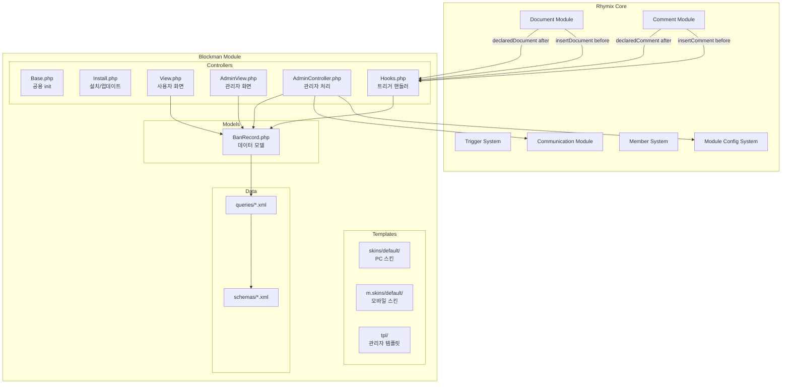
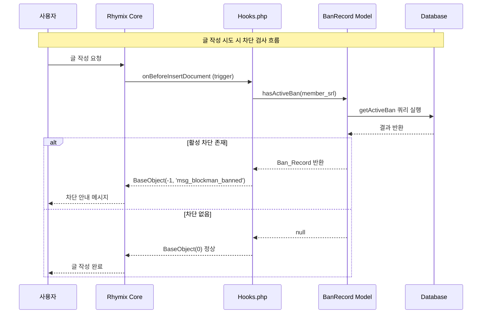
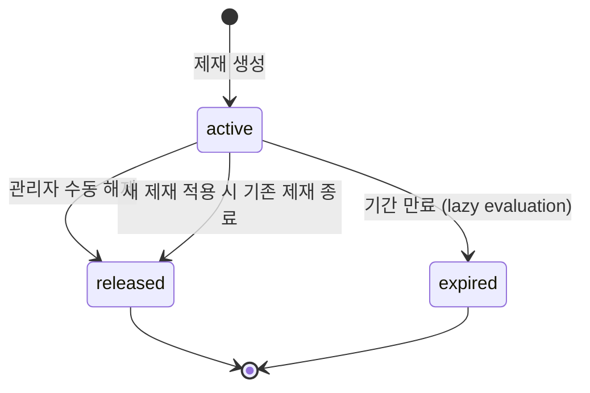

# 기술 설계 문서: Blockman 모듈

## 개요

Blockman은 Rhymix CMS용 회원 제재 관리 모듈로, 관리자가 신고된 사안에 대해 경고/기간차단/영구차단 조치를 취하고, 제재 기록을 공개 열람할 수 있는 이용제한 기록 페이지를 제공한다.

이 모듈은 Rhymix v2 PSR-4 namespace 패턴(`Rhymix\Modules\Blockman`)으로 구현되며, 다음과 같은 핵심 기능을 포함한다:

- **관리자 제재 처리**: 경고(쪽지 발송), 기간차단, 영구차단
- **활동 제한 트리거**: `document.insertDocument` / `comment.insertComment` before 트리거를 통한 차단
- **공개 이용제한 기록**: 목록/상세 페이지를 통한 제재 기록 열람
- **자동 만료**: 기간차단 종료일 경과 시 자동 status 전이
- **차단 해제**: 관리자의 수동 제재 해제

### 설계 결정 사항

| 결정 | 선택 | 근거 |
|------|------|------|
| 모듈 스타일 | v2 PSR-4 namespace | Rhymix 신규 모듈 표준, 자동 탐색 지원 |
| 템플릿 엔진 | v2 Blade (.blade.php) | 신규 템플릿은 v2 권장, 컨텍스트 인식 escape |
| 차단 만료 처리 | Lazy evaluation (활동 시도 시 검사) | 별도 cron 불필요, 즉시 반영 |
| 쪽지 발송 | Communication 모듈 연동 | Rhymix 표준 쪽지 시스템 활용 |
| 기간차단 옵션 | 관리자 설정 가능 (기본: 1, 5, 30, 180일) | 운영 정책 유연성 |
| 권한 체계 | module.xml grants + permission | Rhymix 표준 권한 시스템 |
| 시퀀스 | getNextSequence() | Rhymix 글로벌 시퀀스 (충돌 없음) |

---

## 아키텍처

### 시스템 구성도



### 요청 흐름



---

## 컴포넌트 및 인터페이스

### 1. Controllers

#### Base.php — 공용 베이스 클래스

```php
namespace Rhymix\Modules\Blockman\Controllers;

class Base extends \ModuleObject
{
    public function init()
    {
        // 관리자 템플릿 경로 설정 (관리자 화면용)
        $this->setTemplatePath($this->module_path . 'tpl');
    }
}
```

**역할**: 모든 컨트롤러의 부모 클래스. `init()` 메서드에서 공통 초기화(템플릿 경로 등)를 수행한다.

#### Install.php — 설치/업데이트

```php
namespace Rhymix\Modules\Blockman\Controllers;

class Install extends Base
{
    public function moduleInstall(): \BaseObject;
    public function checkUpdate(): bool;
    public function moduleUpdate(): \BaseObject;
    public function moduleUninstall(): \BaseObject;
}
```

**역할**: 모듈 설치 시 테이블 자동 생성(schemas), 업데이트 시 스키마 변경 적용, 삭제 시 데이터 정리.

#### View.php — 사용자 화면 컨트롤러

```php
namespace Rhymix\Modules\Blockman\Controllers;

use Context;
use Rhymix\Modules\Blockman\Models\BanRecord as BanRecordModel;

class View extends Base
{
    public function init()
    {
        // 사용자 스킨 경로 설정
        $template_path = sprintf('%sskins/%s/', $this->module_path, $this->module_info->skin ?? 'default');
        $this->setTemplatePath($template_path);
    }

    public function dispBlockmanList(): void;    // 이용제한 기록 목록
    public function dispBlockmanDetail(): void;  // 이용제한 기록 상세
}
```

**주요 메서드:**

- `dispBlockmanList()`: getBanRecordList 쿼리를 호출하여 Ban_Record 목록을 조회하고, 검색 조건(user_id)과 페이지네이션을 처리한 뒤 템플릿 변수로 전달.
- `dispBlockmanDetail()`: ban_record_srl을 받아 상세 정보를 조회하고, 해당 회원의 전체 이력(최대 50건)과 소명 기간 계산 결과를 템플릿에 전달.

#### AdminView.php — 관리자 화면 컨트롤러

```php
namespace Rhymix\Modules\Blockman\Controllers;

use Context;
use ModuleModel;
use Rhymix\Modules\Blockman\Models\BanRecord as BanRecordModel;

class AdminView extends Base
{
    public function dispBlockmanAdminConfig(): void;  // 설정 페이지
    public function dispBlockmanAdminList(): void;    // 제재 관리 목록
    public function dispBlockmanAdminAction(): void;  // 제재 처리 화면
}
```

**주요 메서드:**

- `dispBlockmanAdminConfig()`: 현재 모듈 설정(소명 게시판 mid, 사유 태그, 기간 옵션, 열람 권한)을 로드하여 설정 폼에 전달.
- `dispBlockmanAdminList()`: 전체 Ban_Record를 상태별 필터와 함께 페이지네이션으로 표시.
- `dispBlockmanAdminAction()`: 신고 접수 건에 대한 제재 처리 폼을 표시. 대상 회원 정보, 신고 내용, 제재 옵션을 포함.

#### AdminController.php — 관리자 처리 컨트롤러

```php
namespace Rhymix\Modules\Blockman\Controllers;

use Context;
use ModuleModel;
use ModuleController;
use Rhymix\Modules\Blockman\Models\BanRecord as BanRecordModel;

class AdminController extends Base
{
    public function procBlockmanAdminInsertBan(): void;    // 제재 처리 실행
    public function procBlockmanAdminReleaseBan(): void;   // 제재 해제
    public function procBlockmanAdminSaveConfig(): void;   // 설정 저장
}
```

**주요 메서드:**

- `procBlockmanAdminInsertBan()`: 제재 유형(warning/temporary/permanent), 사유, 대상 회원을 받아 유효성 검증 후 Ban_Record 생성. 경고 시 쪽지 발송. 기존 활성 제재가 있으면 종료 처리.
- `procBlockmanAdminReleaseBan()`: ban_record_srl과 해제 사유를 받아 유효성 검증 후 status를 "released"로 변경.
- `procBlockmanAdminSaveConfig()`: 모듈 설정(소명 게시판 mid, 사유 태그 목록, 기간 옵션, 열람 권한)을 검증 후 저장.

#### Hooks.php — 트리거 핸들러

```php
namespace Rhymix\Modules\Blockman\Controllers;

use Context;
use Rhymix\Modules\Blockman\Models\BanRecord as BanRecordModel;

class Hooks extends Base
{
    public function onAfterDeclareDocument(&$obj): \BaseObject;   // 문서 신고 후
    public function onAfterDeclareComment(&$obj): \BaseObject;    // 댓글 신고 후
    public function onBeforeInsertDocument(&$obj): \BaseObject;   // 글 작성 전 차단 검사
    public function onBeforeInsertComment(&$obj): \BaseObject;    // 댓글 작성 전 차단 검사
}
```

**차단 검사 로직 (onBeforeInsertDocument / onBeforeInsertComment):**

1. 작성자 `member_srl` 확인 (비로그인 시 건너뛰기)
2. 관리자(`is_admin == 'Y'`) 여부 확인 → 관리자면 건너뛰기
3. `getActiveBan(member_srl)` 쿼리 실행
4. 활성 차단이 존재하면:
   - `end_date < now()`인 기간차단이면 → status를 "expired"로 갱신하고 정상 통과
   - 그 외 활성 차단이면 → `BaseObject(-1, 'msg_blockman_banned')` 반환
5. DB 오류 발생 시 → 로그 기록 후 정상 `BaseObject()` 반환 (fail-open)

### 2. Models

#### BanRecord.php — 데이터 모델

```php
namespace Rhymix\Modules\Blockman\Models;

class BanRecord
{
    // 조회 메서드
    public static function getList(object $args): object;           // getBanRecordList 쿼리 호출
    public static function getRecord(int $ban_record_srl): ?object; // getBanRecord 쿼리 호출
    public static function getByMember(int $member_srl, int $limit = 50): array; // getBanRecordsByMember 쿼리 호출
    public static function getActiveBan(int $member_srl): ?object;  // getActiveBan 쿼리 호출

    // 조작 메서드
    public static function insert(object $args): object;            // insertBanRecord 쿼리 호출
    public static function updateStatus(int $ban_record_srl, string $status, ?string $released_reason = null): object; // updateBanRecordStatus 쿼리 호출

    // 유효성 검증
    public static function validateBanInput(object $args): ?string; // 입력 유효성 검증, 에러 메시지 또는 null 반환

    // 헬퍼
    public static function formatDuration(object $record): string;  // "주의"/"영구"/"N일" 문자열 생성
    public static function isAppealWindowOpen(object $record): bool; // 소명 기간 활성 여부
    public static function buildWarningMessageTitle(string $reason_detail): string; // 경고 쪽지 제목 생성
    public static function buildWarningMessageBody(object $args): string; // 경고 쪽지 본문 생성
}
```

### 3. 인터페이스 계약

#### AdminController → BanRecord 모델

| 호출 | 입력 | 출력 | 에러 |
|------|------|------|------|
| `BanRecord::insert($args)` | `{ban_record_srl, member_srl, admin_member_srl, ban_type, start_date, end_date, reason_tags, reason_detail, document_srl, comment_srl, declare_message, status, regdate}` | `BaseObject(0)` 성공 | `BaseObject(-1, msg)` 실패 |
| `BanRecord::updateStatus($srl, $status, $reason)` | ban_record_srl, 새 status, 해제 사유 | `BaseObject(0)` 성공 | `BaseObject(-1, msg)` 실패 |
| `BanRecord::getActiveBan($member_srl)` | member_srl | `object\|null` | DB 오류 시 null |

#### AdminController → Communication 모듈

```php
$oCommunicationController = getController('communication');
$output = $oCommunicationController->sendMessage(
    $admin_member_srl,  // sender
    $target_member_srl, // receiver
    $title,             // "[경고] " + 사유 요약 (250자 이내)
    $content            // 제재 사유 상세 + 태그 + 콘텐츠 링크
);
```

#### Hooks → BanRecord 모델

| 호출 | 입력 | 출력 |
|------|------|------|
| `BanRecord::getActiveBan($member_srl)` | member_srl | `object` (활성 차단) 또는 `null` |
| `BanRecord::updateStatus($srl, 'expired')` | ban_record_srl | `BaseObject` |

---

## 데이터 모델

### blockman_ban_records 테이블

| 컬럼명 | 타입 | 크기 | 제약조건 | 설명 |
|--------|------|------|----------|------|
| `ban_record_srl` | number | 11 | PK, NOT NULL | 제재 기록 고유 식별자 (getNextSequence) |
| `member_srl` | number | 11 | NOT NULL | 제재 대상 회원 SRL |
| `admin_member_srl` | number | 11 | NOT NULL | 처리 관리자 회원 SRL |
| `ban_type` | varchar | 20 | NOT NULL | 제재 유형: warning/temporary/permanent |
| `start_date` | date | - | NOT NULL | 제재 시작일시 (YYYYMMDDHHmmss) |
| `end_date` | date | - | NULLABLE | 제재 종료일시 (영구차단은 NULL) |
| `reason_tags` | varchar | 250 | NOT NULL | 사유 태그 (콤마 구분, 최대 10개) |
| `reason_detail` | text | - | NOT NULL | 상세 제재 사유 텍스트 |
| `document_srl` | number | 11 | NULLABLE | 신고된 문서 SRL |
| `comment_srl` | number | 11 | NULLABLE | 신고된 댓글 SRL |
| `declare_message` | text | - | NULLABLE | 신고 메시지 원문 |
| `status` | varchar | 20 | NOT NULL, DEFAULT "active" | 상태: active/released/expired |
| `released_date` | date | - | NULLABLE | 해제 일시 |
| `released_reason` | text | - | NULLABLE | 해제 사유 |
| `regdate` | date | - | NOT NULL | 등록 일시 |

### 인덱스

| 인덱스명 | 컬럼 | 용도 |
|----------|------|------|
| `idx_member_srl` | member_srl | 회원별 제재 기록 조회 |
| `idx_status_enddate` | status, end_date | 활성 차단 조회 + 만료 검사 |
| `idx_start_date` | start_date | 시작일 기준 정렬 |

### 상태 전이도



### 데이터 무결성 규칙

- `ban_type == "temporary"` → `end_date` NOT NULL 필수
- `ban_type == "permanent"` → `end_date` NULL
- `ban_type == "warning"` → 활동 제한 미적용 (기록만)
- `status == "active"` + `ban_type != "warning"` → 활동 제한 적용

### 모듈 설정 (ModuleConfig)

```php
$config = (object)[
    'appeal_board_mid' => 'appeal',         // 소명 게시판 mid
    'reason_tags' => [                       // 사유 태그 목록
        '여론조성', '이용방해', '다중이', '예의없음', '분란유도/갈등조장'
    ],
    'ban_duration_options' => [1, 5, 30, 180],  // 기간차단 옵션 (일 단위)
    'list_access_level' => 'member',            // 열람 권한 (member/manager)
];
```

---

## 정합성 속성 (Correctness Properties)

*정합성 속성(property)은 시스템의 모든 유효한 실행에서 참이어야 하는 특성이다. 즉, 시스템이 무엇을 해야 하는지에 대한 형식적 명세로, 인간이 읽을 수 있는 사양과 기계적으로 검증 가능한 정확성 보장 사이의 다리 역할을 한다.*

### Property 1: 제재 생성 완전성

*For any* 유효한 제재 입력(ban_type, member_srl, reason_tags 1~5개, reason_detail 1~500자), 제재 실행 후 생성된 Ban_Record에는 ban_record_srl, member_srl, admin_member_srl, ban_type, start_date, reason_tags, reason_detail, status("active")가 모두 포함되어야 하며, ban_type이 "temporary"이면 end_date가 start_date보다 미래이고, "permanent"이면 end_date가 null이어야 한다.

**Validates: Requirements 1.1, 1.2, 1.3, 1.5**

### Property 2: 입력 유효성 검증 거부

*For any* 입력에서 reason_tags가 0개이거나 6개 이상이거나, reason_detail이 빈 문자열(공백만 포함 포함)이거나 500자 초과인 경우, 제재 실행은 거부되어야 하며 Ban_Record가 생성되지 않아야 한다.

**Validates: Requirements 1.4, 1.8**

### Property 3: 활성 차단에 의한 글쓰기 차단

*For any* member_srl에 대해, status가 "active"이고 ban_type이 "temporary"(end_date > 현재시각) 또는 "permanent"인 Ban_Record가 존재하면, 해당 회원의 글 작성 및 댓글 작성 시도는 에러 BaseObject를 반환하여 차단되어야 한다.

**Validates: Requirements 4.1, 4.2, 9.3, 9.4**

### Property 4: 기간차단 자동 만료

*For any* ban_type이 "temporary"이고 status가 "active"인 Ban_Record에 대해, end_date가 현재시각보다 과거이면, 다음 차단 검사 시 해당 Ban_Record의 status는 "expired"로 갱신되고 해당 회원의 활동이 허용되어야 한다.

**Validates: Requirements 4.3**

### Property 5: 관리자 차단 면제

*For any* is_admin이 'Y'인 회원에 대해, 활성 Ban_Record의 존재 여부와 관계없이 글 작성 및 댓글 작성 시도는 차단되지 않아야 한다(정상 BaseObject 반환).

**Validates: Requirements 9.8**

### Property 6: 기존 활성 제재 종료 후 신규 적용

*For any* member_srl에 활성 Ban_Record가 존재하는 상태에서 새로운 제재가 적용되면, 기존 활성 Ban_Record의 status는 "released"로 변경되고 새로운 Ban_Record는 status "active"로 생성되어야 한다.

**Validates: Requirements 1.7**

### Property 7: 기간 표시 포맷

*For any* Ban_Record에 대해 기간 포맷 함수를 적용하면, ban_type이 "warning"이면 "주의", "permanent"이면 "영구", "temporary"이면 "(end_date - start_date)일" 형식의 문자열을 반환해야 한다.

**Validates: Requirements 2.6**

### Property 8: 목록 정렬 보장

*For any* Ban_Record 조회 결과 목록에 대해, 목록의 모든 인접 원소 쌍 (i, i+1)에서 i의 start_date >= i+1의 start_date (내림차순)이어야 한다.

**Validates: Requirements 2.2**

### Property 9: 아이디 검색 정확성

*For any* 검색어와 Ban_Record 집합에 대해, 검색 결과에 포함된 모든 레코드의 user_id는 검색어와 정확히 일치해야 한다.

**Validates: Requirements 2.3**

### Property 10: 소명 기간 판정

*For any* Ban_Record와 현재시각에 대해, 제재 시작일로부터 24시간 이상 경과하고 15일(360시간) 이내이면 소명 링크가 활성이어야 하며, 그 외의 경우 비활성이어야 한다.

**Validates: Requirements 3.5, 3.6**

### Property 11: 경고 쪽지 제목 포맷

*For any* 길이의 reason_detail 문자열에 대해, 생성된 경고 쪽지 제목은 "[경고] " 접두사로 시작하고 전체 길이가 250자 이하여야 한다.

**Validates: Requirements 6.2**

### Property 12: Ban_Record 데이터 무결성

*For any* 데이터베이스에 존재하는 Ban_Record에 대해, ban_type이 "temporary"이면 end_date가 null이 아니어야 하고, ban_type이 "permanent"이면 end_date가 null이어야 한다.

**Validates: Requirements 7.6**

### Property 13: 수동 해제 유효성

*For any* 해제 시도에 대해, 대상 Ban_Record의 status가 "active"이고 해제 사유가 1자 이상 500자 이하이면 해제가 성공(status → "released", released_date 기록)해야 하며, status가 "active"가 아니거나 해제 사유가 조건을 충족하지 않으면 해제가 거부되어야 한다.

**Validates: Requirements 11.1, 11.4, 11.5, 11.6**

### Property 14: 해제 후 활동 허용

*For any* member_srl에 대해 모든 Ban_Record의 status가 "released" 또는 "expired"이면(즉, "active" 상태의 기간차단/영구차단이 없으면), 해당 회원의 글 작성 및 댓글 작성 시도는 정상 허용되어야 한다.

**Validates: Requirements 11.2**

---

## 에러 처리

### 에러 처리 전략

| 상황 | 처리 방식 | 사용자 메시지 |
|------|-----------|---------------|
| 차단 검사 중 DB 오류 | Fail-open (정상 허용) + 로그 기록 | 없음 (정상 동작) |
| 신고 트리거 내 예외 | 예외 포착 + 로그 기록 + 정상 BaseObject 반환 | 없음 (신고 처리 계속) |
| 존재하지 않는 회원 제재 시도 | 에러 반환 | `msg_blockman_member_not_found` |
| 필수 입력 누락 | 에러 반환 | `msg_blockman_required_fields` |
| 쪽지 발송 실패 | Ban_Record 생성은 계속 + 경고 메시지 | `msg_blockman_message_send_failed` |
| 유효하지 않은 mid 설정 | 저장 거부 | `msg_blockman_invalid_mid` |
| 비활성 상태 해제 시도 | 거부 | `msg_blockman_cannot_release` |
| 권한 없는 접근 | Rhymix 표준 권한 오류 | `msg_not_permitted` / `msg_not_logged` |

### 트리거 핸들러 에러 격리 원칙

트리거 핸들러는 원래 시스템의 동작을 방해해서는 안 된다:

- **before 트리거 (차단 검사)**: DB 오류 시 차단하지 않고 허용 (fail-open). 보안보다 가용성을 우선.
- **after 트리거 (신고 접수)**: 내부 예외 발생 시 정상 BaseObject 반환하여 원래 신고 처리를 방해하지 않음.

```php
public function onBeforeInsertDocument(&$obj): \BaseObject
{
    try {
        $member_srl = $obj->member_srl ?? Context::get('logged_info')->member_srl ?? 0;
        if (!$member_srl) return new \BaseObject();

        $logged_info = Context::get('logged_info');
        if ($logged_info && $logged_info->is_admin === 'Y') return new \BaseObject();

        $active_ban = BanRecordModel::getActiveBan($member_srl);
        if (!$active_ban) return new \BaseObject();

        // 기간 만료 검사
        if ($active_ban->ban_type === 'temporary' && $active_ban->end_date < date('YmdHis')) {
            BanRecordModel::updateStatus($active_ban->ban_record_srl, 'expired');
            return new \BaseObject();
        }

        return new \BaseObject(-1, 'msg_blockman_banned');
    } catch (\Throwable $e) {
        \Rhymix\Framework\Debug::addError($e->getMessage());
        return new \BaseObject(); // fail-open
    }
}
```

---

## 테스트 전략

### 이중 테스트 접근법

이 모듈은 **단위 테스트**와 **속성 기반 테스트(Property-Based Testing)** 두 가지를 병행한다.

#### 속성 기반 테스트 (PBT)

- **라이브러리**: [QuickCheck for PHP](https://github.com/steos/php-quickcheck) 또는 PHPUnit + 자체 Generator
- **최소 반복 횟수**: 100회 이상
- **태그 형식**: `Feature: blockman-module, Property {N}: {property_text}`

PBT가 적합한 영역:
- 차단 검사 로직 (순수 판정 함수)
- 입력 유효성 검증 로직
- 기간 포맷팅 함수
- 소명 기간 판정 함수
- 경고 쪽지 제목 생성 함수
- 데이터 무결성 검증
- 목록 정렬 검증

#### 단위 테스트 (Example-Based)

단위 테스트가 적합한 영역:
- 페이지네이션 설정 확인 (list_count=20, page_count=10)
- UI 링크 생성 검증
- Communication 모듈 연동 (mock 기반)
- 빈 목록 시 안내 메시지 표시
- 삭제된 콘텐츠 참조 시 안내 문구

#### 통합 테스트

- module.xml eventHandler 선언 확인
- schemas XML 형식 검증
- 설정 저장/로드 라운드트립
- 실제 DB에서의 쿼리 실행

### 테스트 구조

```
tests/
├── Unit/
│   ├── BanRecordModelTest.php        # 모델 메서드 단위 테스트
│   ├── AdminControllerTest.php       # 관리자 처리 테스트
│   └── HooksTest.php                 # 트리거 핸들러 테스트
├── Property/
│   ├── BanCheckPropertyTest.php      # Property 3, 4, 5, 14
│   ├── ValidationPropertyTest.php    # Property 1, 2, 12, 13
│   ├── FormattingPropertyTest.php    # Property 7, 10, 11
│   └── QueryPropertyTest.php         # Property 8, 9
└── Integration/
    ├── TriggerRegistrationTest.php   # 트리거 등록 검증
    └── ConfigPersistenceTest.php     # 설정 영속성 검증
```

### PBT 테스트 예시

```php
/**
 * Feature: blockman-module, Property 3: 활성 차단에 의한 글쓰기 차단
 * For any member_srl with active ban (temporary with future end_date or permanent),
 * write attempts should be blocked.
 */
public function testActiveBanBlocksWriteAttempts(): void
{
    // Generator: 임의의 member_srl + 활성 Ban_Record (temporary|permanent)
    for ($i = 0; $i < 100; $i++) {
        $member_srl = random_int(1, 999999);
        $ban_type = array_rand(['temporary' => 1, 'permanent' => 1]);
        $end_date = $ban_type === 'temporary'
            ? date('YmdHis', strtotime('+' . random_int(1, 365) . ' days'))
            : null;

        // Ban_Record 삽입 (mock 또는 실제 DB)
        $ban = $this->createActiveBan($member_srl, $ban_type, $end_date);

        // 차단 검사 실행
        $result = $this->hooks->onBeforeInsertDocument((object)['member_srl' => $member_srl]);

        // 검증: 에러 반환
        $this->assertFalse($result->toBool(), "Active ban should block writes for member {$member_srl}");
    }
}
```

```php
/**
 * Feature: blockman-module, Property 12: Ban_Record 데이터 무결성
 * For any Ban_Record, temporary must have end_date, permanent must not.
 */
public function testBanRecordDataIntegrity(): void
{
    for ($i = 0; $i < 100; $i++) {
        $ban_type = ['warning', 'temporary', 'permanent'][random_int(0, 2)];
        $end_date = $ban_type === 'temporary'
            ? date('YmdHis', strtotime('+' . random_int(1, 3650) . ' days'))
            : null;

        $args = $this->generateValidBanArgs($ban_type, $end_date);
        $result = BanRecordModel::insert($args);

        if ($ban_type === 'temporary') {
            $this->assertTrue($result->toBool());
            $record = BanRecordModel::getRecord($args->ban_record_srl);
            $this->assertNotNull($record->end_date);
        } elseif ($ban_type === 'permanent') {
            $this->assertTrue($result->toBool());
            $record = BanRecordModel::getRecord($args->ban_record_srl);
            $this->assertNull($record->end_date);
        }
    }
}
```
